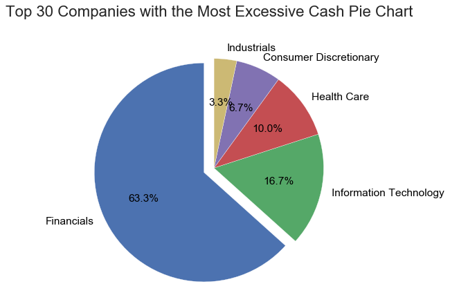
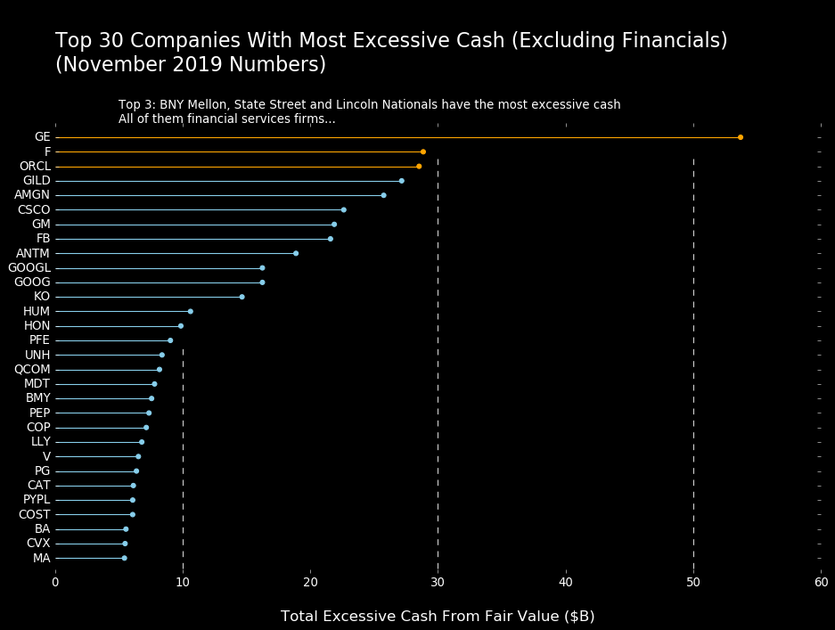
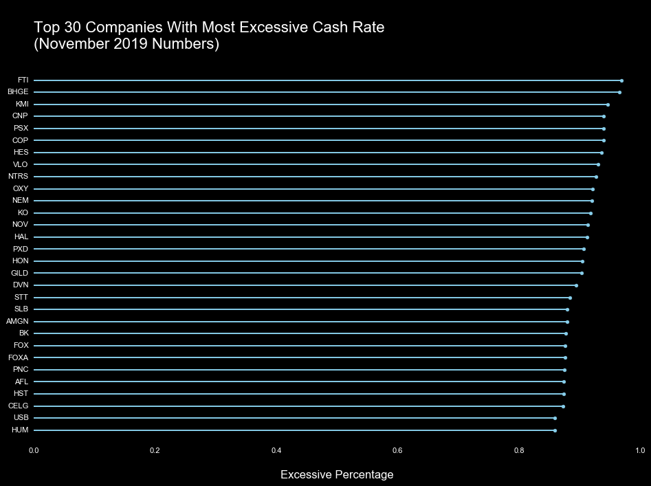
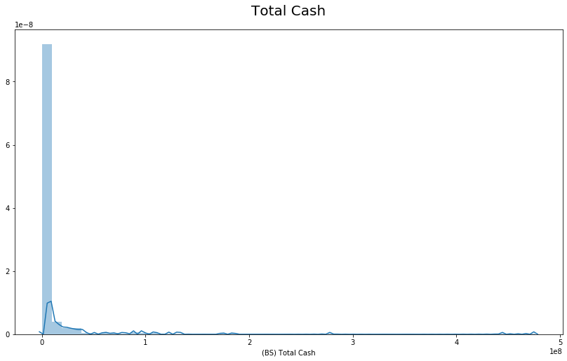
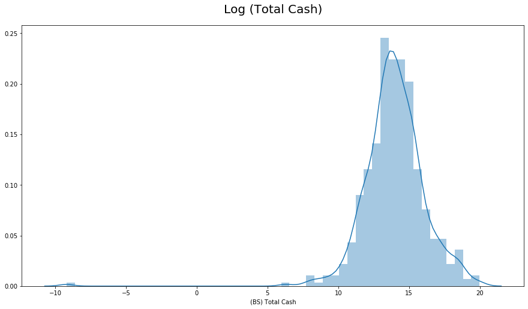
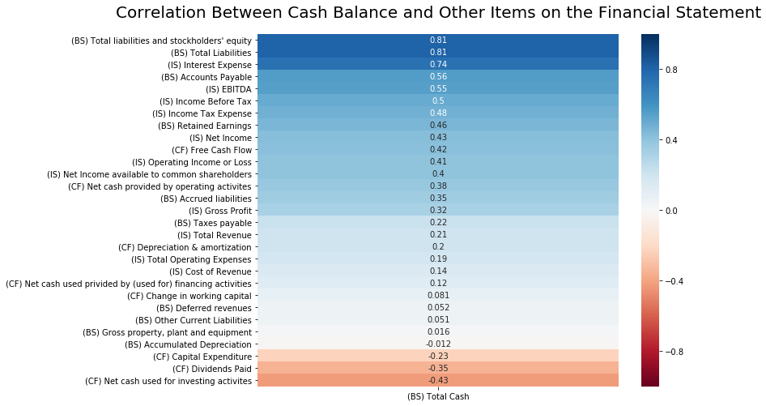

# Excessive Cash Losing Investors Billions: A Research to Show the Numbers

### Problem Statement 

Every company has investments in cash and cash equivalents (short-term bonds, commercial papers, etc.). Holding enough cash in a company’s balance sheet is crucial for a company’s day-to-day operations, investments and crisis response capabilities.

However, there is dark side to this. Many investors draw a distinction between operating cash and excessive cash. Operating cash is considered essentially to a company’s operation and overall well-being. Excessive cash on the other hand, is the portion of cash that is idle or earning below market interest rate (risk free rate). Instead of returning these excessive cash to its investors so they could be invested in other opportunities, many companies hold back, thereby creating waste and destroying value for its shareholders.

This project is aimed at leveraging regression models to determine the “fair cash balance” a company should hold based on a number of characteristics (sector, ROE, assets, etc.). We are exploring the following questions:

1. What are the biggest contributing factors to the cash balance?
2. Which industries have the most cash relative to their asset? What are the possible reasons behind this phenomenon?
3. Which companies hold the most excessive cash in absolute terms?
4. Which companies hold the most excessive cash in relative terms?
5. How many companies hold cash values way above their normal band fair cash balance? (>50% over its fair cash value)

**Author**

[David Li](https://www.linkedin.com/in/davidgnli/)

---

### Data Sources
1. [Yahoo Finance](https://finance.yahoo.com/): One of the best sources for public market data.
2. [Data Hub](https://datahub.io/core/s-and-p-500-companies-financials#data-cli): Clean csv file for S&P 500 components.

---

### Project Files

Here is the workflow order to follow when running through the notebooks, which can be found in the [code folder](./code):

- [Data Collection From Yahoo Finance Jupyter Notebook](./code/)
- [Data Cleaning, EDA, Modeling and Analysis Jupyter Notebook](./code/)

---

### Executive Summary

This report represents my analysis of the “fair cash balance” for each company in the S&P 500 index, which tracks 500 established American companies that represents the health of the US equity market. Using Beautiful Soup, we collected annual financial statement data from Yahoo Finance in November 2019 to provide the basis for the analysis. Here are some of the conclusions I found:

- **Data collected**: We collected data from Yahoo Finance instead of the source for each company. We are trusting Yahoo Finance to get it right and use their data to do our analysis. After cross-validating a few data points, Yahoo Finance seems to get their data right.

- **Financial services companies hold the most amount of cash**: I quickly find that financial services companies (as shown below), especially banks and asset managers, hold the most excessive cash. Since these companies provide liquidity for the entire market to keep it running, the excessive cash is a part of their business model. In addition, because of strengthening regulations after the financial crisis, banks and financial services companies are required to hold more cash than they would optimally do.

> Pie Chart for Top 30 Companies w/ Most Excessive Cash (Absolute)

- **Technology and health care companies are most likely to hold excessive cash**: As the graph shows below, other than banks, technology and health care companies have the most excessive cash. This is because a lot of these companies don’t have much of a bottom line to speak of and they have to reinvest in their business a lot to grow and to survive. The flexibility of a large cash balance gives them the ability to invest in their business without having to constantly raise new capital.

> Top 30 Companies (Excluding Financials) w/ Most Excessive Cash

- **155 companies in the S&P 500 hold too much cash**: We’ve already talked about how companies destroy value by holding too much cash. Investors in these companies should really pressure the management and make sure there is a good story of why they are holding this much cash.

> Top 30 Companies w/ Most Excessive Cash Rate

---
### Data Collection (Yahoo Finance)
All data used in this report are scarped from Yahoo Finance. Yahoo Finance assigns unique link to each stock based on the stock ticker. I created flexible functions that scrapes all the most important financial statement data and market stats for each company tracked by the S&P 500. 

You can view the detailed data collection process from here: 

- [Data Collection From Yahoo Finance Jupyter Notebook](./code/)

---
### Dataset
**Name** | **Description
--- | ---
`spx_df.csv` | This dataset contains financial statements for 474 companies tracked by the S&P 500 index in November 2019, including balance sheet, income statement and cash flow statement reported by each company for the past 4 years. 
`spx_stats.csv` | This dataset contains the market statistics for 474 companies tracked by the S&P 500 index in November 2019. Examples include 52-week Low, PE ratios, beta, average trading volume, etc. 
'constituents.csv` | This dataset contains all 500 companies in S&P 500 (fall name, stock ticker and sector). We use this dataset to initiate the data collection and attach the sector for each company scraped from Yahoo Finance.

---
### Modeling

Feature engineering is key in this project as it requires previous knowledge in stock and valuation. The goal here is to find a set of factors that best describe what the “fair cash balance” should be for a company with certain characteristics. We will use the cash balance as target variable. By taking the log of the variable, I can get a much better target to model against. 

> Target Variable: Total Cash

> Target Variable: Log(Total Cash)

I looked at the variables that would provide us the best insights. I started the process by looking at the raw columns and see which ones might have a high correlation to the balance of cash. A few themes jump out:

> Correlations btw Cash Balance and Financial Statement Items

- **Scale**: Companies with more assets or liabilities tend to have larger cash balances.
- **Short-term debt**: The account payables represent the short-term debt that the company has to pay up in the near term. This is pretty obvious because the company need to use cash to off those immediate liabilities to keep the company running.
- **Profit**: The amount of profit is also positively correlated to cash balances. As the profit base increases, companies will get to keep more cash. Given I’m learning about the company on the enterprise level, I will lean more on EBITDA instead of net income and gross profit.
- **Short-term Reinvestment and Long-term Reinvestment**: As the company needs to reinvest more, they will need to hold more cash at hand. Short-term reinvestment is represented by change of working capital and long-term reinvestment is represented by net capital expenditure. Net cash used by investing activities is also a reasonable proxy.
- **Payout ratio**: It’s also important to look at how much is paid out as dividend.

Besides the most obvious themes. There are a few more themes that would intuitively affect the balance of cash:

- **Growth rate**: Fundamental growth rate of the company is measured by how much the company is reinvesting back in its business and its return on capital. For simplicity reasons, we can use the yoy quarterly growth rate. Higher growth companies usually hold more cash.
- **Sector**: Each sector behave different from the overall market. We will be using dummy variables to look at stocks in each sector.

--- 

### Limitations
1. We have financial statement up to only 4 years and market statistics for one the current period: Yahoo Finance requires premium account to go deeper into history. With more data, we could calculate better growth rate and dive deeper into how the companies evolved through the years.
2. The financial statement we collected is the annual statement, many of which were published a long time ago. As market conditions change over time, we are subject to historical bias.
3. This goes without saying, the tools we created are limited to publicly traded companies that reports earnings. With that being said, ETFs and other asset class would not do have these attributes.
4. Yahoo updates its site from time to time. So this would likely not be a long-term solution. We might be able to use other sources for future use, such as the SimFin API.
5. Scraping is slow because of caution of being blacklisted. We implemented random sleep in the function. We could use rotating proxies to speed things up.
6. Yahoo finance has very incomplete data for a few companies. Due to time constraints, some of these values need to be deduced from other factors. There are many ways to find these values in the official 10K and 10Q given a longer span of time.
7. There are opportunities for better feature engineering. We could get a more accurate growth rate with more historical data. We could also calculate elements such as the WACC, return on capital and other extremely import metrics given more time and better quality data.

### Next Steps
1. Get more historical data to better understand the company's growth trajectory instead of just relying on current day statistics.
2. Deep dive into sectors and industries within those sectors to understand how companies with different characteristcs behave.
3. Understanding macro market environment, such as interest rate, inflation, unemployment and overall GDP growth.
4. Putting these company on a global scale, looking not only how companies perform in the US but how they behave in Europe, Asia Pacifics, South America and other global and regional markets.
5. Infer better data points that are more correlated with our target, such as weight average cost of capital, return on capital, research and operations, etc.
6. Go into the industry level instead of just the sector level to get a better understanding of how different companies act.
7. We need a larger sample size than just 500 companies. Our data collection toolkit could help us collect this data in bulk pretty efficiently.
8. The world is changing fast so is the market. We could automate the entire process and have data update themselves continuously.